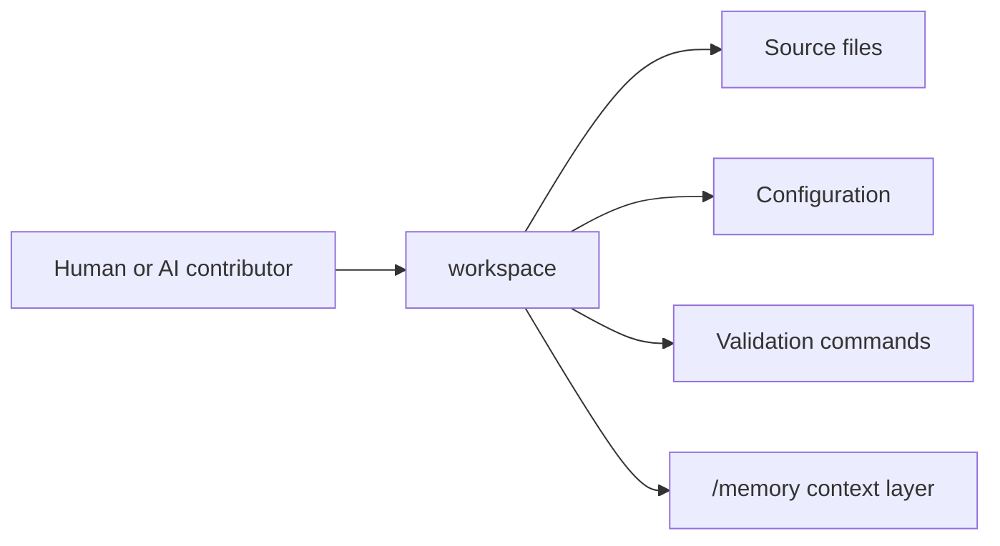

# System Architecture

**Last Updated:** 2026-08-05

---

## Architecture Summary

This is an inferred architecture document. Treat sections marked `[INFERRED]`, `[PLANNED]`, or `[INCOMPLETE]` as prompts for verification before making architectural changes.

## Runtime Shape

- Project profile: `mixed`
- Detected profiles: `cli-package`, `frontend`, `mixed`
- Frameworks: React, Vitest

## Mermaid Sketch

## Deployment Hints

- `AGENTS.md`
- `README.md`
- `deploy/agentmemory/Dockerfile`
- `extensions/shawq-advanced-dom-pixel/README.md`
- `package.json`
- `shopify/pdp-intelligence-probe.js`
- `src/App.jsx`
- `src/App.render.test.jsx`
- `src/components/dashboard/BehaviorAnalytics.tsx`
- `src/components/dashboard/DailyDelivery.tsx`
- `src/components/dashboard/EmptyState.tsx`
- `src/components/dashboard/KpiCard.tsx`
- `src/components/dashboard/OrdersMap.tsx`
- `src/components/dashboard/Sidebar.tsx`
- `src/components/dashboard/UsaComparison.tsx`
- `src/lib/adapt.js`
- `src/lib/tabInsights.js`
- `src/main.jsx`

## Open Architecture Questions

- [INCOMPLETE] Confirm service boundaries and runtime communication paths with maintainers.
- [INCOMPLETE] Add diagrams for deployed infrastructure once verified.
